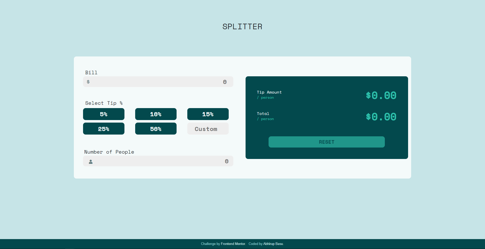
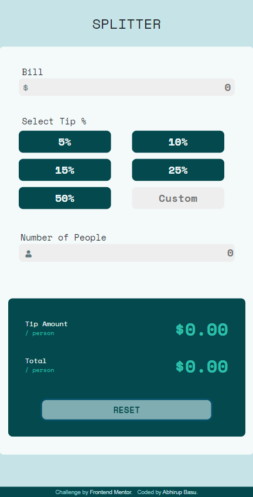

# Frontend Mentor - Tip calculator app solution

This is a solution to the [Tip calculator app challenge on Frontend Mentor](https://www.frontendmentor.io/challenges/tip-calculator-app-ugJNGbJUX). Frontend Mentor challenges help you improve your coding skills by building realistic projects.

## Table of contents

- [Overview](#overview)
  - [The challenge](#the-challenge)
  - [Screenshots](#screenshots)
  - [Links](#links)
- [My process](#my-process)
  - [Built with](#built-with)
  - [Useful resources](#useful-resources)
- [Author](#author)
- [Acknowledgments](#acknowledgments)


## Overview

### The challenge

Users should be able to:

- View the optimal layout for the app depending on their device's screen size
- See hover states for all interactive elements on the page
- Calculate the correct tip and total cost of the bill per person


### Screenshots






### Links

- Solution URL: [GitHub](https://github.com/basuabhirup/tip-calculator)
- Live Site URL: [Vercel](https://tip-calculator-basuabhirup.vercel.app/)

## My process

### Built with

- HTML 5
- CSS 3 
- Javascript ES 6
- Mobile-first workflow
- [Bootstrap 5](https://getbootstrap.com/docs/5.0/getting-started/introduction/) - CSS library
- [jQuery 3.6.0](https://jquery.com/download/) - Javascript Library
- [Font Awesome](https://fontawesome.com/) - For styles & icons


### What I learned

I have gained hands-on experience in manipulating DOM objects with JavaScript & its jQuery library. Also I have created some data validation conditions in order to make the calculator's functionalities as realistic as possible. 

I have created a custom caculateTip function where I have added several validation checks against the input values of bill-amount & number-of-people:


```js
// Defining the custom calculateTip function:
function calculateTip(tipPercantage) {
  var billAmount = parseFloat($("#bill-amount").val(), 10);
  var tipTotal = billAmount * tipPercantage;
  var numPeople = parseFloat($("#no-of-people").val(), 10); // holds the value of number of people
  var billPerHead = billAmount / numPeople;
  var tipPerHead = tipTotal / numPeople;
  var totalPerHead = billPerHead + tipPerHead;


  if (billAmount > 0) { // validates the Bill-Input value
    if ($(".bill-input").hasClass("error")) { // revokes red error border style, if already present
      $(".bill-input").removeClass("error");
    }
    if (numPeople > 0 && Number.isInteger(numPeople)) { // checks whether num-of-people is an integer
      $(".error-text").text(""); // revokes error message, if already present
      if ($(".people-input").hasClass("error")) { // revokes red error border style, if already present
        $(".people-input").removeClass("error");
      }
      if (!isNaN(tipPercantage)) { // checks whether the Tip-Percantage is a number or not
        $("#tip-per-head").text(parseFloat(tipPerHead.toFixed(2)));
        $("#tip-total").text(parseFloat(totalPerHead.toFixed(2)));
        $(".reset-button").removeClass("disabled");
      }
    } else if (numPeople > 0 && !Number.isInteger(numPeople)) { // when no-of-people is not an integer
      $(".people-input").addClass("error"); // adds error class to place red border of the input field
      $(".error-text").text("Must be an integer!"); // shows error message
    } else if (numPeople < 0) { // when no-of-people is negative
      $(".people-input").addClass("error"); // adds error class to place red border of the input field
      $(".error-text").text("Can't be negative!"); // shows error message
    } else { // when no-of-people is zero
      $(".people-input").addClass("error"); // adds error class to place red border of the input field
      $(".error-text").text("Can't be zero!"); // shows error message
    }

  } else if (billAmount < 0) {
    $(".bill-input").addClass("error");
    $("#tip-per-head").text("0.00");
    $("#tip-total").text("0.00");
  }
}

}
```

I have called this custom function several times against "click" or "keyup" events on different input fields.


### Useful resources

- [W3 Schools](https://www.w3schools.com/cssref/default.asp) 
- [Mozilla Developer Network](https://developer.mozilla.org/en-US/docs/Learn) 
- [DevDocs](https://devdocs.io/css/)


## Author

### __Abhirup Basu__

- GitHub - [@basuabhirup](https://github.com/basuabhirup)
- LinkedIn - [@basu-abhirup](https://www.linkedin.com/in/basu-abhirup/)
- Frontend Mentor - [@basuabhirup](https://www.frontendmentor.io/profile/basuabhirup)
- Twitter - [@basu_abhirup27](https://www.twitter.com/basu_abhirup27)

